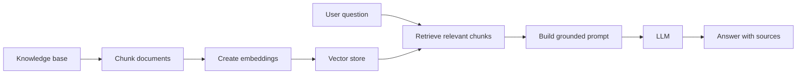

# Retrieval-Augmented Generation

Retrieval-augmented generation, usually called RAG, adds relevant external
knowledge to a model request before generating an answer.

RAG is useful when the model needs information that is private, current, or
specific to the application domain.

## Business Scenario

Imagine an internal assistant for a SaaS billing product.

Support agents ask questions such as:

```text
How should I explain a canceled annual subscription with a failed renewal?
```

The answer should be grounded in company documentation:

- billing policies;
- subscription lifecycle rules;
- refund rules;
- support playbooks;
- product limitations.

Instead of sending all documents to the model, the application retrieves only
the most relevant pieces and includes them in the prompt.

## RAG Flow



## Core Steps

### 1. Ingest Documents

Collect source material such as:

- Markdown documentation;
- product FAQs;
- support playbooks;
- API docs;
- architecture notes.

Good source material should be reviewed and owned by the team.

### 2. Chunk Content

Split documents into smaller pieces.

Chunking matters because retrieval quality depends on the size and clarity of
each chunk.

Useful chunking rules:

- keep related ideas together;
- avoid chunks that are too small to provide context;
- avoid chunks that are too large to retrieve precisely;
- include metadata such as document name, section, and version.

### 3. Create Embeddings

Embeddings convert text chunks into vectors that can be compared by semantic
similarity.

The application stores these vectors in a vector store.

### 4. Retrieve Relevant Chunks

When the user asks a question, the application searches for the most relevant
chunks.

The retrieval result should include:

- chunk text;
- source document;
- section;
- relevance score when available.

### 5. Generate Grounded Answer

The prompt should instruct the model to answer only using retrieved context.

Example rule:

```text
Use only the provided context. If the context does not answer the question,
say what information is missing.
```

## Prompt Shape

```text
You are a support assistant for a SaaS billing platform.

Use only the provided context to answer.
If the answer is not present in the context, say that the information is missing.
Include source titles used for the answer.

Context:
{retrievedContext}

Question:
{question}
```

## Response Shape

```java
public record GroundedAnswer(
        String answer,
        List<String> sources,
        String confidence,
        List<String> missingInformation
) {
}
```

## When RAG Is Better Than Long Prompts

Use RAG when:

- documents are too large for one prompt;
- information changes over time;
- answers need source traceability;
- the application uses private knowledge;
- different users need different authorized context.

Avoid RAG when:

- the task does not require external knowledge;
- the source documents are low quality;
- retrieval cannot be evaluated;
- the answer must be fully deterministic.

## Security Considerations

RAG can leak sensitive information if retrieval is not scoped correctly.

Important controls:

- filter documents by user authorization;
- avoid indexing secrets;
- store source metadata;
- log retrieval ids instead of full sensitive content;
- separate public and private knowledge bases;
- validate that retrieved context belongs to the requester.

## Evaluation Questions

Evaluate RAG with questions like:

- Did the system retrieve the right documents?
- Did the answer use only retrieved context?
- Did the answer cite the right sources?
- Did the model admit missing information?
- Did latency stay acceptable?
- Did retrieval respect authorization boundaries?

## Stakeholder Explanation

```text
RAG lets the assistant answer with company-approved knowledge instead of relying
only on the model's general memory. It improves relevance, traceability, and
control, especially for internal support and documentation use cases.
```

## Interview Talking Points

- RAG combines retrieval with generation.
- Chunk quality affects answer quality.
- Source metadata makes answers more auditable.
- Authorization must apply before retrieved context reaches the model.
- RAG is useful when answers need private or current knowledge.
